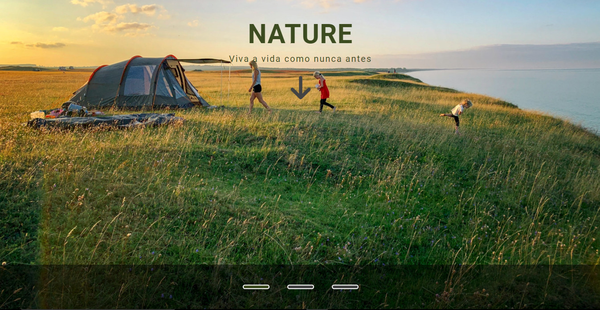
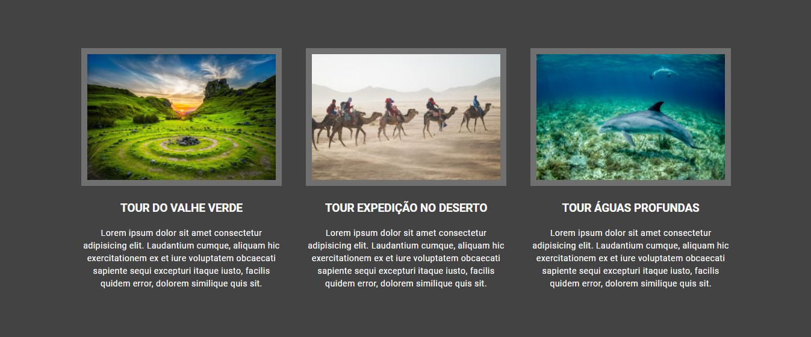
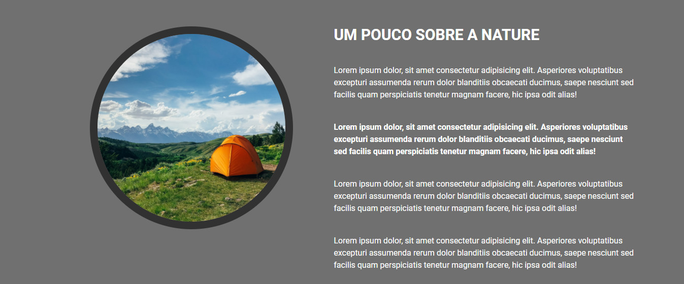

# Nature-jr

Landing page that offers tours in different places around the world.

# Home

This is the hero section of the website, it has the title, subtitle, a arrow that if clicked takes the user to the next section and a navigation
that changes the image of the section.



# Tours

In this section the users can see the tours the website offers to them. The tours are listed in cards format, each card has the tour's image, its
name and description.


# About

The about section is intended to have some information about the team behind the website.


# Running the project

In order to run this project, you have to install some dependencies and to install them you just need to run the code below on your terminal:

```
npm install
```

The project uses Gulp to make the development process easier, to start the Gulp tasks and the local server go to the terminal and run:

```
gulp
```
